```python
import pandas as pd
import numpy as np
import matplotlib.pyplot as plt
import seaborn as sns
from sklearn.preprocessing import StandardScaler
scalar=StandardScaler()
from sklearn.decomposition import PCA
from sklearn.cluster import KMeans,AgglomerativeClustering,DBSCAN,SpectralClustering
from sklearn.mixture import GaussianMixture
from sklearn.metrics import silhouette_samples, silhouette_score
from sklearn.tree import DecisionTreeClassifier
from sklearn.model_selection import train_test_split
from sklearn.metrics import classification_report
from sklearn import tree
from sklearn import metrics

import warnings
warnings.filterwarnings("ignore") 
```


```python
df = pd.read_csv("Customer Data.csv")
df
```


<div>
<style scoped>
    .dataframe tbody tr th:only-of-type {
        vertical-align: middle;
    }

    .dataframe tbody tr th {
        vertical-align: top;
    }

    .dataframe thead th {
        text-align: right;
    }
</style>
<table border="1" class="dataframe">
  <thead>
    <tr style="text-align: right;">
      <th></th>
      <th>CUST_ID</th>
      <th>BALANCE</th>
      <th>BALANCE_FREQUENCY</th>
      <th>PURCHASES</th>
      <th>ONEOFF_PURCHASES</th>
      <th>INSTALLMENTS_PURCHASES</th>
      <th>CASH_ADVANCE</th>
      <th>PURCHASES_FREQUENCY</th>
      <th>ONEOFF_PURCHASES_FREQUENCY</th>
      <th>PURCHASES_INSTALLMENTS_FREQUENCY</th>
      <th>CASH_ADVANCE_FREQUENCY</th>
      <th>CASH_ADVANCE_TRX</th>
      <th>PURCHASES_TRX</th>
      <th>CREDIT_LIMIT</th>
      <th>PAYMENTS</th>
      <th>MINIMUM_PAYMENTS</th>
      <th>PRC_FULL_PAYMENT</th>
      <th>TENURE</th>
    </tr>
  </thead>
  <tbody>
    <tr>
      <th>0</th>
      <td>C10001</td>
      <td>40.900749</td>
      <td>0.818182</td>
      <td>95.40</td>
      <td>0.00</td>
      <td>95.40</td>
      <td>0.000000</td>
      <td>0.166667</td>
      <td>0.000000</td>
      <td>0.083333</td>
      <td>0.000000</td>
      <td>0</td>
      <td>2</td>
      <td>1000.0</td>
      <td>201.802084</td>
      <td>139.509787</td>
      <td>0.000000</td>
      <td>12</td>
    </tr>
    <tr>
      <th>1</th>
      <td>C10002</td>
      <td>3202.467416</td>
      <td>0.909091</td>
      <td>0.00</td>
      <td>0.00</td>
      <td>0.00</td>
      <td>6442.945483</td>
      <td>0.000000</td>
      <td>0.000000</td>
      <td>0.000000</td>
      <td>0.250000</td>
      <td>4</td>
      <td>0</td>
      <td>7000.0</td>
      <td>4103.032597</td>
      <td>1072.340217</td>
      <td>0.222222</td>
      <td>12</td>
    </tr>
    <tr>
      <th>2</th>
      <td>C10003</td>
      <td>2495.148862</td>
      <td>1.000000</td>
      <td>773.17</td>
      <td>773.17</td>
      <td>0.00</td>
      <td>0.000000</td>
      <td>1.000000</td>
      <td>1.000000</td>
      <td>0.000000</td>
      <td>0.000000</td>
      <td>0</td>
      <td>12</td>
      <td>7500.0</td>
      <td>622.066742</td>
      <td>627.284787</td>
      <td>0.000000</td>
      <td>12</td>
    </tr>
    <tr>
      <th>3</th>
      <td>C10004</td>
      <td>1666.670542</td>
      <td>0.636364</td>
      <td>1499.00</td>
      <td>1499.00</td>
      <td>0.00</td>
      <td>205.788017</td>
      <td>0.083333</td>
      <td>0.083333</td>
      <td>0.000000</td>
      <td>0.083333</td>
      <td>1</td>
      <td>1</td>
      <td>7500.0</td>
      <td>0.000000</td>
      <td>NaN</td>
      <td>0.000000</td>
      <td>12</td>
    </tr>
    <tr>
      <th>4</th>
      <td>C10005</td>
      <td>817.714335</td>
      <td>1.000000</td>
      <td>16.00</td>
      <td>16.00</td>
      <td>0.00</td>
      <td>0.000000</td>
      <td>0.083333</td>
      <td>0.083333</td>
      <td>0.000000</td>
      <td>0.000000</td>
      <td>0</td>
      <td>1</td>
      <td>1200.0</td>
      <td>678.334763</td>
      <td>244.791237</td>
      <td>0.000000</td>
      <td>12</td>
    </tr>
    <tr>
      <th>...</th>
      <td>...</td>
      <td>...</td>
      <td>...</td>
      <td>...</td>
      <td>...</td>
      <td>...</td>
      <td>...</td>
      <td>...</td>
      <td>...</td>
      <td>...</td>
      <td>...</td>
      <td>...</td>
      <td>...</td>
      <td>...</td>
      <td>...</td>
      <td>...</td>
      <td>...</td>
      <td>...</td>
    </tr>
    <tr>
      <th>8945</th>
      <td>C19186</td>
      <td>28.493517</td>
      <td>1.000000</td>
      <td>291.12</td>
      <td>0.00</td>
      <td>291.12</td>
      <td>0.000000</td>
      <td>1.000000</td>
      <td>0.000000</td>
      <td>0.833333</td>
      <td>0.000000</td>
      <td>0</td>
      <td>6</td>
      <td>1000.0</td>
      <td>325.594462</td>
      <td>48.886365</td>
      <td>0.500000</td>
      <td>6</td>
    </tr>
    <tr>
      <th>8946</th>
      <td>C19187</td>
      <td>19.183215</td>
      <td>1.000000</td>
      <td>300.00</td>
      <td>0.00</td>
      <td>300.00</td>
      <td>0.000000</td>
      <td>1.000000</td>
      <td>0.000000</td>
      <td>0.833333</td>
      <td>0.000000</td>
      <td>0</td>
      <td>6</td>
      <td>1000.0</td>
      <td>275.861322</td>
      <td>NaN</td>
      <td>0.000000</td>
      <td>6</td>
    </tr>
    <tr>
      <th>8947</th>
      <td>C19188</td>
      <td>23.398673</td>
      <td>0.833333</td>
      <td>144.40</td>
      <td>0.00</td>
      <td>144.40</td>
      <td>0.000000</td>
      <td>0.833333</td>
      <td>0.000000</td>
      <td>0.666667</td>
      <td>0.000000</td>
      <td>0</td>
      <td>5</td>
      <td>1000.0</td>
      <td>81.270775</td>
      <td>82.418369</td>
      <td>0.250000</td>
      <td>6</td>
    </tr>
    <tr>
      <th>8948</th>
      <td>C19189</td>
      <td>13.457564</td>
      <td>0.833333</td>
      <td>0.00</td>
      <td>0.00</td>
      <td>0.00</td>
      <td>36.558778</td>
      <td>0.000000</td>
      <td>0.000000</td>
      <td>0.000000</td>
      <td>0.166667</td>
      <td>2</td>
      <td>0</td>
      <td>500.0</td>
      <td>52.549959</td>
      <td>55.755628</td>
      <td>0.250000</td>
      <td>6</td>
    </tr>
    <tr>
      <th>8949</th>
      <td>C19190</td>
      <td>372.708075</td>
      <td>0.666667</td>
      <td>1093.25</td>
      <td>1093.25</td>
      <td>0.00</td>
      <td>127.040008</td>
      <td>0.666667</td>
      <td>0.666667</td>
      <td>0.000000</td>
      <td>0.333333</td>
      <td>2</td>
      <td>23</td>
      <td>1200.0</td>
      <td>63.165404</td>
      <td>88.288956</td>
      <td>0.000000</td>
      <td>6</td>
    </tr>
  </tbody>
</table>
<p>8950 rows × 18 columns</p>
</div>


```python
df.shape #see how many rows and columns
```


    (8950, 18)


```python
df.info() #see how many null values
```

    <class 'pandas.core.frame.DataFrame'>
    RangeIndex: 8950 entries, 0 to 8949
    Data columns (total 18 columns):
     #   Column                            Non-Null Count  Dtype  
    ---  ------                            --------------  -----  
     0   CUST_ID                           8950 non-null   object 
     1   BALANCE                           8950 non-null   float64
     2   BALANCE_FREQUENCY                 8950 non-null   float64
     3   PURCHASES                         8950 non-null   float64
     4   ONEOFF_PURCHASES                  8950 non-null   float64
     5   INSTALLMENTS_PURCHASES            8950 non-null   float64
     6   CASH_ADVANCE                      8950 non-null   float64
     7   PURCHASES_FREQUENCY               8950 non-null   float64
     8   ONEOFF_PURCHASES_FREQUENCY        8950 non-null   float64
     9   PURCHASES_INSTALLMENTS_FREQUENCY  8950 non-null   float64
     10  CASH_ADVANCE_FREQUENCY            8950 non-null   float64
     11  CASH_ADVANCE_TRX                  8950 non-null   int64  
     12  PURCHASES_TRX                     8950 non-null   int64  
     13  CREDIT_LIMIT                      8949 non-null   float64
     14  PAYMENTS                          8950 non-null   float64
     15  MINIMUM_PAYMENTS                  8637 non-null   float64
     16  PRC_FULL_PAYMENT                  8950 non-null   float64
     17  TENURE                            8950 non-null   int64  
    dtypes: float64(14), int64(3), object(1)
    memory usage: 1.2+ MB
    


```python
df.describe() #gives statistical info
```


<div>
<style scoped>
    .dataframe tbody tr th:only-of-type {
        vertical-align: middle;
    }

    .dataframe tbody tr th {
        vertical-align: top;
    }

    .dataframe thead th {
        text-align: right;
    }
</style>
<table border="1" class="dataframe">
  <thead>
    <tr style="text-align: right;">
      <th></th>
      <th>BALANCE</th>
      <th>BALANCE_FREQUENCY</th>
      <th>PURCHASES</th>
      <th>ONEOFF_PURCHASES</th>
      <th>INSTALLMENTS_PURCHASES</th>
      <th>CASH_ADVANCE</th>
      <th>PURCHASES_FREQUENCY</th>
      <th>ONEOFF_PURCHASES_FREQUENCY</th>
      <th>PURCHASES_INSTALLMENTS_FREQUENCY</th>
      <th>CASH_ADVANCE_FREQUENCY</th>
      <th>CASH_ADVANCE_TRX</th>
      <th>PURCHASES_TRX</th>
      <th>CREDIT_LIMIT</th>
      <th>PAYMENTS</th>
      <th>MINIMUM_PAYMENTS</th>
      <th>PRC_FULL_PAYMENT</th>
      <th>TENURE</th>
    </tr>
  </thead>
  <tbody>
    <tr>
      <th>count</th>
      <td>8950.000000</td>
      <td>8950.000000</td>
      <td>8950.000000</td>
      <td>8950.000000</td>
      <td>8950.000000</td>
      <td>8950.000000</td>
      <td>8950.000000</td>
      <td>8950.000000</td>
      <td>8950.000000</td>
      <td>8950.000000</td>
      <td>8950.000000</td>
      <td>8950.000000</td>
      <td>8949.000000</td>
      <td>8950.000000</td>
      <td>8637.000000</td>
      <td>8950.000000</td>
      <td>8950.000000</td>
    </tr>
    <tr>
      <th>mean</th>
      <td>1564.474828</td>
      <td>0.877271</td>
      <td>1003.204834</td>
      <td>592.437371</td>
      <td>411.067645</td>
      <td>978.871112</td>
      <td>0.490351</td>
      <td>0.202458</td>
      <td>0.364437</td>
      <td>0.135144</td>
      <td>3.248827</td>
      <td>14.709832</td>
      <td>4494.449450</td>
      <td>1733.143852</td>
      <td>864.206542</td>
      <td>0.153715</td>
      <td>11.517318</td>
    </tr>
    <tr>
      <th>std</th>
      <td>2081.531879</td>
      <td>0.236904</td>
      <td>2136.634782</td>
      <td>1659.887917</td>
      <td>904.338115</td>
      <td>2097.163877</td>
      <td>0.401371</td>
      <td>0.298336</td>
      <td>0.397448</td>
      <td>0.200121</td>
      <td>6.824647</td>
      <td>24.857649</td>
      <td>3638.815725</td>
      <td>2895.063757</td>
      <td>2372.446607</td>
      <td>0.292499</td>
      <td>1.338331</td>
    </tr>
    <tr>
      <th>min</th>
      <td>0.000000</td>
      <td>0.000000</td>
      <td>0.000000</td>
      <td>0.000000</td>
      <td>0.000000</td>
      <td>0.000000</td>
      <td>0.000000</td>
      <td>0.000000</td>
      <td>0.000000</td>
      <td>0.000000</td>
      <td>0.000000</td>
      <td>0.000000</td>
      <td>50.000000</td>
      <td>0.000000</td>
      <td>0.019163</td>
      <td>0.000000</td>
      <td>6.000000</td>
    </tr>
    <tr>
      <th>25%</th>
      <td>128.281915</td>
      <td>0.888889</td>
      <td>39.635000</td>
      <td>0.000000</td>
      <td>0.000000</td>
      <td>0.000000</td>
      <td>0.083333</td>
      <td>0.000000</td>
      <td>0.000000</td>
      <td>0.000000</td>
      <td>0.000000</td>
      <td>1.000000</td>
      <td>1600.000000</td>
      <td>383.276166</td>
      <td>169.123707</td>
      <td>0.000000</td>
      <td>12.000000</td>
    </tr>
    <tr>
      <th>50%</th>
      <td>873.385231</td>
      <td>1.000000</td>
      <td>361.280000</td>
      <td>38.000000</td>
      <td>89.000000</td>
      <td>0.000000</td>
      <td>0.500000</td>
      <td>0.083333</td>
      <td>0.166667</td>
      <td>0.000000</td>
      <td>0.000000</td>
      <td>7.000000</td>
      <td>3000.000000</td>
      <td>856.901546</td>
      <td>312.343947</td>
      <td>0.000000</td>
      <td>12.000000</td>
    </tr>
    <tr>
      <th>75%</th>
      <td>2054.140036</td>
      <td>1.000000</td>
      <td>1110.130000</td>
      <td>577.405000</td>
      <td>468.637500</td>
      <td>1113.821139</td>
      <td>0.916667</td>
      <td>0.300000</td>
      <td>0.750000</td>
      <td>0.222222</td>
      <td>4.000000</td>
      <td>17.000000</td>
      <td>6500.000000</td>
      <td>1901.134317</td>
      <td>825.485459</td>
      <td>0.142857</td>
      <td>12.000000</td>
    </tr>
    <tr>
      <th>max</th>
      <td>19043.138560</td>
      <td>1.000000</td>
      <td>49039.570000</td>
      <td>40761.250000</td>
      <td>22500.000000</td>
      <td>47137.211760</td>
      <td>1.000000</td>
      <td>1.000000</td>
      <td>1.000000</td>
      <td>1.500000</td>
      <td>123.000000</td>
      <td>358.000000</td>
      <td>30000.000000</td>
      <td>50721.483360</td>
      <td>76406.207520</td>
      <td>1.000000</td>
      <td>12.000000</td>
    </tr>
  </tbody>
</table>
</div>


```python
df.isnull().sum() #MINIMUM_PAYMENTS have 313 null values as shown 
```


    CUST_ID                               0
    BALANCE                               0
    BALANCE_FREQUENCY                     0
    PURCHASES                             0
    ONEOFF_PURCHASES                      0
    INSTALLMENTS_PURCHASES                0
    CASH_ADVANCE                          0
    PURCHASES_FREQUENCY                   0
    ONEOFF_PURCHASES_FREQUENCY            0
    PURCHASES_INSTALLMENTS_FREQUENCY      0
    CASH_ADVANCE_FREQUENCY                0
    CASH_ADVANCE_TRX                      0
    PURCHASES_TRX                         0
    CREDIT_LIMIT                          1
    PAYMENTS                              0
    MINIMUM_PAYMENTS                    313
    PRC_FULL_PAYMENT                      0
    TENURE                                0
    dtype: int64


```python
# filling mean value in place of missing values in the dataset with mean values (null value imputation)
df["MINIMUM_PAYMENTS"] = df["MINIMUM_PAYMENTS"].fillna(df["MINIMUM_PAYMENTS"].mean())
df["CREDIT_LIMIT"] = df["CREDIT_LIMIT"].fillna(df["CREDIT_LIMIT"].mean())
```


```python
df.isnull().sum() #checking for null values (none are found)
```


    CUST_ID                             0
    BALANCE                             0
    BALANCE_FREQUENCY                   0
    PURCHASES                           0
    ONEOFF_PURCHASES                    0
    INSTALLMENTS_PURCHASES              0
    CASH_ADVANCE                        0
    PURCHASES_FREQUENCY                 0
    ONEOFF_PURCHASES_FREQUENCY          0
    PURCHASES_INSTALLMENTS_FREQUENCY    0
    CASH_ADVANCE_FREQUENCY              0
    CASH_ADVANCE_TRX                    0
    PURCHASES_TRX                       0
    CREDIT_LIMIT                        0
    PAYMENTS                            0
    MINIMUM_PAYMENTS                    0
    PRC_FULL_PAYMENT                    0
    TENURE                              0
    dtype: int64


```python
# checking for duplicate rows in the dataset (no duplicate rows)
df.duplicated().sum()
```


    0


```python
# drop CUST_ID column because it is not used
df.drop(columns=["CUST_ID"],axis=1,inplace=True)
```


```python
df.columns # listing out the columns in the dataset
```


    Index(['BALANCE', 'BALANCE_FREQUENCY', 'PURCHASES', 'ONEOFF_PURCHASES',
           'INSTALLMENTS_PURCHASES', 'CASH_ADVANCE', 'PURCHASES_FREQUENCY',
           'ONEOFF_PURCHASES_FREQUENCY', 'PURCHASES_INSTALLMENTS_FREQUENCY',
           'CASH_ADVANCE_FREQUENCY', 'CASH_ADVANCE_TRX', 'PURCHASES_TRX',
           'CREDIT_LIMIT', 'PAYMENTS', 'MINIMUM_PAYMENTS', 'PRC_FULL_PAYMENT',
           'TENURE'],
          dtype='object')


```python
# plotting the Kernel Density Estimation Plot (kdeplot)
#to estimate the prob dist of the data cause we dont have the math function
# shows the probabilty distribution for each column. none of them have a normal prob dist
plt.figure(figsize=(30,45))
for i, col in enumerate(df.columns):
    if df[col].dtype != 'object':
        ax = plt.subplot(9, 2, i+1)
        sns.kdeplot(df[col], ax=ax)
        plt.xlabel(col)
        
plt.show()
```


    
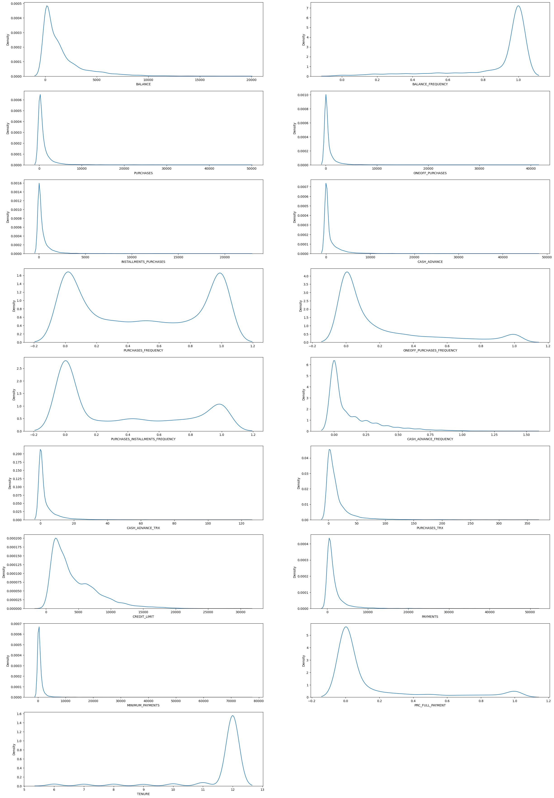
    


```python
#correlation matrix (checking the relation between the columns in the dataset)
plt.figure(figsize=(12,12))
sns.heatmap(df.corr(), annot=True)
plt.show()
```


    
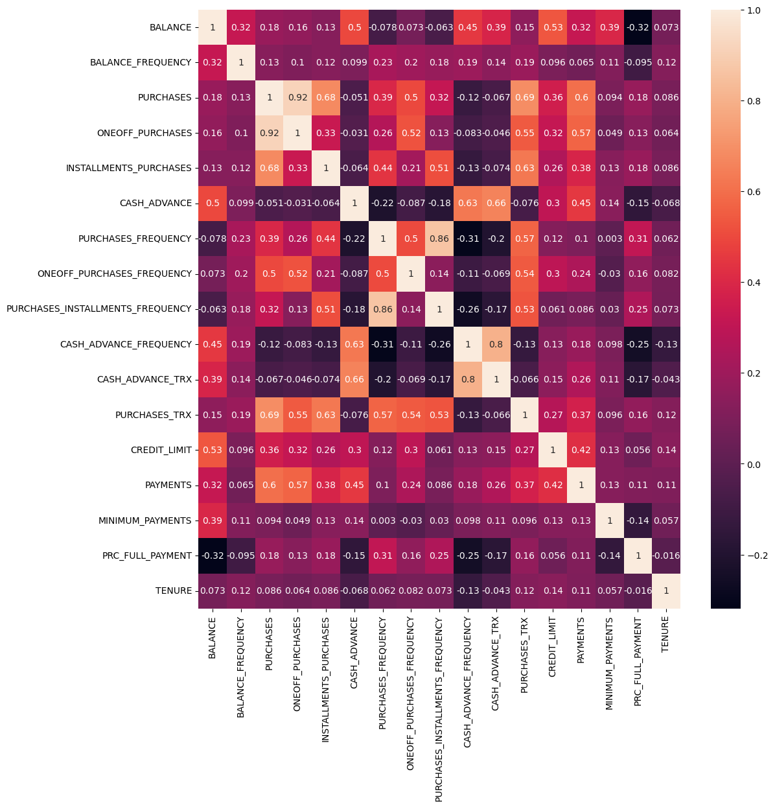
    


```python
# feature scaling (rescaling all the data to a common range to make sure all features contribute equally to the model)
# scalar=StandardScaler
scaled_df = scalar.fit_transform(df)
```


```python
#principal component analysis 
#dimensionality reduction to reduce complexity and no. of features while still focussing on variance
#for faster processing, reduced redundancy
#transform a dataset containing multiple features into a lower-dimensional space while retaining the 
#most significant information (variance) in the data.
pca = PCA(n_components=2)
principal_components = pca.fit_transform(scaled_df)
pca_df = pd.DataFrame(data=principal_components ,columns=["PCA1","PCA2"])
pca_df
```


<div>
<style scoped>
    .dataframe tbody tr th:only-of-type {
        vertical-align: middle;
    }

    .dataframe tbody tr th {
        vertical-align: top;
    }

    .dataframe thead th {
        text-align: right;
    }
</style>
<table border="1" class="dataframe">
  <thead>
    <tr style="text-align: right;">
      <th></th>
      <th>PCA1</th>
      <th>PCA2</th>
    </tr>
  </thead>
  <tbody>
    <tr>
      <th>0</th>
      <td>-1.682219</td>
      <td>-1.076453</td>
    </tr>
    <tr>
      <th>1</th>
      <td>-1.138293</td>
      <td>2.506474</td>
    </tr>
    <tr>
      <th>2</th>
      <td>0.969676</td>
      <td>-0.383503</td>
    </tr>
    <tr>
      <th>3</th>
      <td>-0.873625</td>
      <td>0.043160</td>
    </tr>
    <tr>
      <th>4</th>
      <td>-1.599434</td>
      <td>-0.688581</td>
    </tr>
    <tr>
      <th>...</th>
      <td>...</td>
      <td>...</td>
    </tr>
    <tr>
      <th>8945</th>
      <td>-0.359628</td>
      <td>-2.016147</td>
    </tr>
    <tr>
      <th>8946</th>
      <td>-0.564366</td>
      <td>-1.639130</td>
    </tr>
    <tr>
      <th>8947</th>
      <td>-0.926202</td>
      <td>-1.810789</td>
    </tr>
    <tr>
      <th>8948</th>
      <td>-2.336549</td>
      <td>-0.657973</td>
    </tr>
    <tr>
      <th>8949</th>
      <td>-0.556425</td>
      <td>-0.400461</td>
    </tr>
  </tbody>
</table>
<p>8950 rows × 2 columns</p>
</div>


```python
# Finding k using clustering (K-means clustering)
inertia = []
range_val = range(1,15)
for i in range_val:
    kmean = KMeans(n_clusters=i)
    kmean.fit_predict(pd.DataFrame(scaled_df))
    inertia.append(kmean.inertia_)
plt.plot(range_val,inertia,'bx-')
plt.xlabel('Values of K') 
plt.ylabel('Inertia') 
plt.title('The Elbow Method using Inertia') 
plt.show()
# graph forms elbow at k=4
```


    
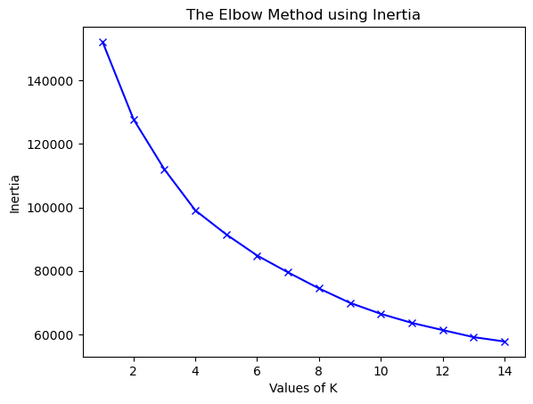
    


```python
kmeans_model=KMeans(4) # k=4
kmeans_model.fit_predict(scaled_df)
pca_df_kmeans= pd.concat([pca_df,pd.DataFrame({'cluster':kmeans_model.labels_})],axis=1)
```


```python
plt.figure(figsize=(8,8))
ax=sns.scatterplot(x="PCA1",y="PCA2",hue="cluster",data=pca_df_kmeans,palette=['red','blue','green','black'])
plt.title("Clustering using K-Means Algorithm")
plt.show()
# 4 separate clusters have been formed
```


    
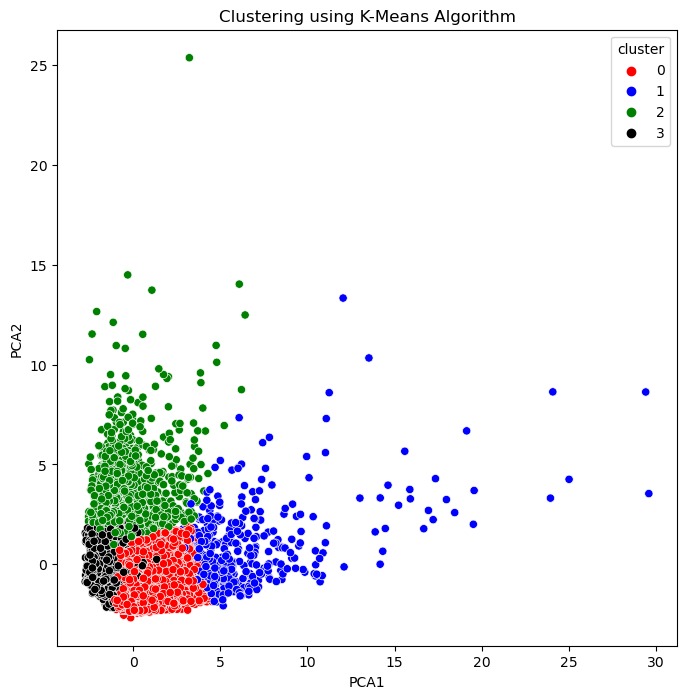
    


```python
# find all cluster centers
cluster_centers = pd.DataFrame(data=kmeans_model.cluster_centers_,columns=[df.columns])
# inverse transform the data
cluster_centers = scalar.inverse_transform(cluster_centers)
cluster_centers = pd.DataFrame(data=cluster_centers,columns=[df.columns])
cluster_centers

```


<div>
<style scoped>
    .dataframe tbody tr th:only-of-type {
        vertical-align: middle;
    }

    .dataframe tbody tr th {
        vertical-align: top;
    }

    .dataframe thead tr th {
        text-align: left;
    }
</style>
<table border="1" class="dataframe">
  <thead>
    <tr>
      <th></th>
      <th>BALANCE</th>
      <th>BALANCE_FREQUENCY</th>
      <th>PURCHASES</th>
      <th>ONEOFF_PURCHASES</th>
      <th>INSTALLMENTS_PURCHASES</th>
      <th>CASH_ADVANCE</th>
      <th>PURCHASES_FREQUENCY</th>
      <th>ONEOFF_PURCHASES_FREQUENCY</th>
      <th>PURCHASES_INSTALLMENTS_FREQUENCY</th>
      <th>CASH_ADVANCE_FREQUENCY</th>
      <th>CASH_ADVANCE_TRX</th>
      <th>PURCHASES_TRX</th>
      <th>CREDIT_LIMIT</th>
      <th>PAYMENTS</th>
      <th>MINIMUM_PAYMENTS</th>
      <th>PRC_FULL_PAYMENT</th>
      <th>TENURE</th>
    </tr>
  </thead>
  <tbody>
    <tr>
      <th>0</th>
      <td>894.907458</td>
      <td>0.934734</td>
      <td>1236.178934</td>
      <td>593.974874</td>
      <td>642.478274</td>
      <td>210.570626</td>
      <td>0.885165</td>
      <td>0.297070</td>
      <td>0.711842</td>
      <td>0.042573</td>
      <td>0.790021</td>
      <td>22.091773</td>
      <td>4213.207678</td>
      <td>1332.194205</td>
      <td>650.167072</td>
      <td>0.269258</td>
      <td>11.594595</td>
    </tr>
    <tr>
      <th>1</th>
      <td>3551.153761</td>
      <td>0.986879</td>
      <td>7681.620098</td>
      <td>5095.878826</td>
      <td>2587.208264</td>
      <td>653.638891</td>
      <td>0.946418</td>
      <td>0.739031</td>
      <td>0.788060</td>
      <td>0.071290</td>
      <td>2.085575</td>
      <td>89.359413</td>
      <td>9696.943765</td>
      <td>7288.739497</td>
      <td>1976.815179</td>
      <td>0.286707</td>
      <td>11.951100</td>
    </tr>
    <tr>
      <th>2</th>
      <td>4602.462714</td>
      <td>0.968415</td>
      <td>501.896219</td>
      <td>320.373681</td>
      <td>181.607404</td>
      <td>4520.724309</td>
      <td>0.287731</td>
      <td>0.138934</td>
      <td>0.185516</td>
      <td>0.484526</td>
      <td>14.284641</td>
      <td>7.661102</td>
      <td>7546.957050</td>
      <td>3481.145990</td>
      <td>2008.251157</td>
      <td>0.034859</td>
      <td>11.387312</td>
    </tr>
    <tr>
      <th>3</th>
      <td>1011.751528</td>
      <td>0.789871</td>
      <td>269.973466</td>
      <td>209.853863</td>
      <td>60.386625</td>
      <td>595.759339</td>
      <td>0.170146</td>
      <td>0.086281</td>
      <td>0.080578</td>
      <td>0.114833</td>
      <td>2.125503</td>
      <td>2.903421</td>
      <td>3277.703165</td>
      <td>974.505090</td>
      <td>586.301239</td>
      <td>0.078001</td>
      <td>11.446429</td>
    </tr>
  </tbody>
</table>
</div>


```python
# Creating a target column "Cluster" for storing the cluster segment
cluster_df = pd.concat([df,pd.DataFrame({'Cluster':kmeans_model.labels_})],axis=1)
cluster_df
# creates another dataset identical to the original dataset but with an extra column called Cluster
# essentially unsupervised model has become a supervised model
```


<div>
<style scoped>
    .dataframe tbody tr th:only-of-type {
        vertical-align: middle;
    }

    .dataframe tbody tr th {
        vertical-align: top;
    }

    .dataframe thead th {
        text-align: right;
    }
</style>
<table border="1" class="dataframe">
  <thead>
    <tr style="text-align: right;">
      <th></th>
      <th>BALANCE</th>
      <th>BALANCE_FREQUENCY</th>
      <th>PURCHASES</th>
      <th>ONEOFF_PURCHASES</th>
      <th>INSTALLMENTS_PURCHASES</th>
      <th>CASH_ADVANCE</th>
      <th>PURCHASES_FREQUENCY</th>
      <th>ONEOFF_PURCHASES_FREQUENCY</th>
      <th>PURCHASES_INSTALLMENTS_FREQUENCY</th>
      <th>CASH_ADVANCE_FREQUENCY</th>
      <th>CASH_ADVANCE_TRX</th>
      <th>PURCHASES_TRX</th>
      <th>CREDIT_LIMIT</th>
      <th>PAYMENTS</th>
      <th>MINIMUM_PAYMENTS</th>
      <th>PRC_FULL_PAYMENT</th>
      <th>TENURE</th>
      <th>Cluster</th>
    </tr>
  </thead>
  <tbody>
    <tr>
      <th>0</th>
      <td>40.900749</td>
      <td>0.818182</td>
      <td>95.40</td>
      <td>0.00</td>
      <td>95.40</td>
      <td>0.000000</td>
      <td>0.166667</td>
      <td>0.000000</td>
      <td>0.083333</td>
      <td>0.000000</td>
      <td>0</td>
      <td>2</td>
      <td>1000.0</td>
      <td>201.802084</td>
      <td>139.509787</td>
      <td>0.000000</td>
      <td>12</td>
      <td>3</td>
    </tr>
    <tr>
      <th>1</th>
      <td>3202.467416</td>
      <td>0.909091</td>
      <td>0.00</td>
      <td>0.00</td>
      <td>0.00</td>
      <td>6442.945483</td>
      <td>0.000000</td>
      <td>0.000000</td>
      <td>0.000000</td>
      <td>0.250000</td>
      <td>4</td>
      <td>0</td>
      <td>7000.0</td>
      <td>4103.032597</td>
      <td>1072.340217</td>
      <td>0.222222</td>
      <td>12</td>
      <td>2</td>
    </tr>
    <tr>
      <th>2</th>
      <td>2495.148862</td>
      <td>1.000000</td>
      <td>773.17</td>
      <td>773.17</td>
      <td>0.00</td>
      <td>0.000000</td>
      <td>1.000000</td>
      <td>1.000000</td>
      <td>0.000000</td>
      <td>0.000000</td>
      <td>0</td>
      <td>12</td>
      <td>7500.0</td>
      <td>622.066742</td>
      <td>627.284787</td>
      <td>0.000000</td>
      <td>12</td>
      <td>0</td>
    </tr>
    <tr>
      <th>3</th>
      <td>1666.670542</td>
      <td>0.636364</td>
      <td>1499.00</td>
      <td>1499.00</td>
      <td>0.00</td>
      <td>205.788017</td>
      <td>0.083333</td>
      <td>0.083333</td>
      <td>0.000000</td>
      <td>0.083333</td>
      <td>1</td>
      <td>1</td>
      <td>7500.0</td>
      <td>0.000000</td>
      <td>864.206542</td>
      <td>0.000000</td>
      <td>12</td>
      <td>3</td>
    </tr>
    <tr>
      <th>4</th>
      <td>817.714335</td>
      <td>1.000000</td>
      <td>16.00</td>
      <td>16.00</td>
      <td>0.00</td>
      <td>0.000000</td>
      <td>0.083333</td>
      <td>0.083333</td>
      <td>0.000000</td>
      <td>0.000000</td>
      <td>0</td>
      <td>1</td>
      <td>1200.0</td>
      <td>678.334763</td>
      <td>244.791237</td>
      <td>0.000000</td>
      <td>12</td>
      <td>3</td>
    </tr>
    <tr>
      <th>...</th>
      <td>...</td>
      <td>...</td>
      <td>...</td>
      <td>...</td>
      <td>...</td>
      <td>...</td>
      <td>...</td>
      <td>...</td>
      <td>...</td>
      <td>...</td>
      <td>...</td>
      <td>...</td>
      <td>...</td>
      <td>...</td>
      <td>...</td>
      <td>...</td>
      <td>...</td>
      <td>...</td>
    </tr>
    <tr>
      <th>8945</th>
      <td>28.493517</td>
      <td>1.000000</td>
      <td>291.12</td>
      <td>0.00</td>
      <td>291.12</td>
      <td>0.000000</td>
      <td>1.000000</td>
      <td>0.000000</td>
      <td>0.833333</td>
      <td>0.000000</td>
      <td>0</td>
      <td>6</td>
      <td>1000.0</td>
      <td>325.594462</td>
      <td>48.886365</td>
      <td>0.500000</td>
      <td>6</td>
      <td>0</td>
    </tr>
    <tr>
      <th>8946</th>
      <td>19.183215</td>
      <td>1.000000</td>
      <td>300.00</td>
      <td>0.00</td>
      <td>300.00</td>
      <td>0.000000</td>
      <td>1.000000</td>
      <td>0.000000</td>
      <td>0.833333</td>
      <td>0.000000</td>
      <td>0</td>
      <td>6</td>
      <td>1000.0</td>
      <td>275.861322</td>
      <td>864.206542</td>
      <td>0.000000</td>
      <td>6</td>
      <td>0</td>
    </tr>
    <tr>
      <th>8947</th>
      <td>23.398673</td>
      <td>0.833333</td>
      <td>144.40</td>
      <td>0.00</td>
      <td>144.40</td>
      <td>0.000000</td>
      <td>0.833333</td>
      <td>0.000000</td>
      <td>0.666667</td>
      <td>0.000000</td>
      <td>0</td>
      <td>5</td>
      <td>1000.0</td>
      <td>81.270775</td>
      <td>82.418369</td>
      <td>0.250000</td>
      <td>6</td>
      <td>0</td>
    </tr>
    <tr>
      <th>8948</th>
      <td>13.457564</td>
      <td>0.833333</td>
      <td>0.00</td>
      <td>0.00</td>
      <td>0.00</td>
      <td>36.558778</td>
      <td>0.000000</td>
      <td>0.000000</td>
      <td>0.000000</td>
      <td>0.166667</td>
      <td>2</td>
      <td>0</td>
      <td>500.0</td>
      <td>52.549959</td>
      <td>55.755628</td>
      <td>0.250000</td>
      <td>6</td>
      <td>3</td>
    </tr>
    <tr>
      <th>8949</th>
      <td>372.708075</td>
      <td>0.666667</td>
      <td>1093.25</td>
      <td>1093.25</td>
      <td>0.00</td>
      <td>127.040008</td>
      <td>0.666667</td>
      <td>0.666667</td>
      <td>0.000000</td>
      <td>0.333333</td>
      <td>2</td>
      <td>23</td>
      <td>1200.0</td>
      <td>63.165404</td>
      <td>88.288956</td>
      <td>0.000000</td>
      <td>6</td>
      <td>3</td>
    </tr>
  </tbody>
</table>
<p>8950 rows × 18 columns</p>
</div>


```python
# separate dataset for cluster 1
cluster_1_df = cluster_df[cluster_df["Cluster"]==0]
cluster_1_df
```


<div>
<style scoped>
    .dataframe tbody tr th:only-of-type {
        vertical-align: middle;
    }

    .dataframe tbody tr th {
        vertical-align: top;
    }

    .dataframe thead th {
        text-align: right;
    }
</style>
<table border="1" class="dataframe">
  <thead>
    <tr style="text-align: right;">
      <th></th>
      <th>BALANCE</th>
      <th>BALANCE_FREQUENCY</th>
      <th>PURCHASES</th>
      <th>ONEOFF_PURCHASES</th>
      <th>INSTALLMENTS_PURCHASES</th>
      <th>CASH_ADVANCE</th>
      <th>PURCHASES_FREQUENCY</th>
      <th>ONEOFF_PURCHASES_FREQUENCY</th>
      <th>PURCHASES_INSTALLMENTS_FREQUENCY</th>
      <th>CASH_ADVANCE_FREQUENCY</th>
      <th>CASH_ADVANCE_TRX</th>
      <th>PURCHASES_TRX</th>
      <th>CREDIT_LIMIT</th>
      <th>PAYMENTS</th>
      <th>MINIMUM_PAYMENTS</th>
      <th>PRC_FULL_PAYMENT</th>
      <th>TENURE</th>
      <th>Cluster</th>
    </tr>
  </thead>
  <tbody>
    <tr>
      <th>2</th>
      <td>2495.148862</td>
      <td>1.000000</td>
      <td>773.17</td>
      <td>773.17</td>
      <td>0.00</td>
      <td>0.0</td>
      <td>1.000000</td>
      <td>1.00</td>
      <td>0.000000</td>
      <td>0.0</td>
      <td>0</td>
      <td>12</td>
      <td>7500.0</td>
      <td>622.066742</td>
      <td>627.284787</td>
      <td>0.00</td>
      <td>12</td>
      <td>0</td>
    </tr>
    <tr>
      <th>5</th>
      <td>1809.828751</td>
      <td>1.000000</td>
      <td>1333.28</td>
      <td>0.00</td>
      <td>1333.28</td>
      <td>0.0</td>
      <td>0.666667</td>
      <td>0.00</td>
      <td>0.583333</td>
      <td>0.0</td>
      <td>0</td>
      <td>8</td>
      <td>1800.0</td>
      <td>1400.057770</td>
      <td>2407.246035</td>
      <td>0.00</td>
      <td>12</td>
      <td>0</td>
    </tr>
    <tr>
      <th>7</th>
      <td>1823.652743</td>
      <td>1.000000</td>
      <td>436.20</td>
      <td>0.00</td>
      <td>436.20</td>
      <td>0.0</td>
      <td>1.000000</td>
      <td>0.00</td>
      <td>1.000000</td>
      <td>0.0</td>
      <td>0</td>
      <td>12</td>
      <td>2300.0</td>
      <td>679.065082</td>
      <td>532.033990</td>
      <td>0.00</td>
      <td>12</td>
      <td>0</td>
    </tr>
    <tr>
      <th>10</th>
      <td>1293.124939</td>
      <td>1.000000</td>
      <td>920.12</td>
      <td>0.00</td>
      <td>920.12</td>
      <td>0.0</td>
      <td>1.000000</td>
      <td>0.00</td>
      <td>1.000000</td>
      <td>0.0</td>
      <td>0</td>
      <td>12</td>
      <td>1200.0</td>
      <td>1083.301007</td>
      <td>2172.697765</td>
      <td>0.00</td>
      <td>12</td>
      <td>0</td>
    </tr>
    <tr>
      <th>12</th>
      <td>1516.928620</td>
      <td>1.000000</td>
      <td>3217.99</td>
      <td>2500.23</td>
      <td>717.76</td>
      <td>0.0</td>
      <td>1.000000</td>
      <td>0.25</td>
      <td>0.916667</td>
      <td>0.0</td>
      <td>0</td>
      <td>26</td>
      <td>3000.0</td>
      <td>608.263689</td>
      <td>490.207013</td>
      <td>0.25</td>
      <td>12</td>
      <td>0</td>
    </tr>
    <tr>
      <th>...</th>
      <td>...</td>
      <td>...</td>
      <td>...</td>
      <td>...</td>
      <td>...</td>
      <td>...</td>
      <td>...</td>
      <td>...</td>
      <td>...</td>
      <td>...</td>
      <td>...</td>
      <td>...</td>
      <td>...</td>
      <td>...</td>
      <td>...</td>
      <td>...</td>
      <td>...</td>
      <td>...</td>
    </tr>
    <tr>
      <th>8940</th>
      <td>130.838554</td>
      <td>1.000000</td>
      <td>591.24</td>
      <td>0.00</td>
      <td>591.24</td>
      <td>0.0</td>
      <td>1.000000</td>
      <td>0.00</td>
      <td>0.833333</td>
      <td>0.0</td>
      <td>0</td>
      <td>6</td>
      <td>1000.0</td>
      <td>475.523262</td>
      <td>82.771320</td>
      <td>1.00</td>
      <td>6</td>
      <td>0</td>
    </tr>
    <tr>
      <th>8942</th>
      <td>40.829749</td>
      <td>1.000000</td>
      <td>113.28</td>
      <td>0.00</td>
      <td>113.28</td>
      <td>0.0</td>
      <td>1.000000</td>
      <td>0.00</td>
      <td>0.833333</td>
      <td>0.0</td>
      <td>0</td>
      <td>6</td>
      <td>1000.0</td>
      <td>94.488828</td>
      <td>86.283101</td>
      <td>0.25</td>
      <td>6</td>
      <td>0</td>
    </tr>
    <tr>
      <th>8945</th>
      <td>28.493517</td>
      <td>1.000000</td>
      <td>291.12</td>
      <td>0.00</td>
      <td>291.12</td>
      <td>0.0</td>
      <td>1.000000</td>
      <td>0.00</td>
      <td>0.833333</td>
      <td>0.0</td>
      <td>0</td>
      <td>6</td>
      <td>1000.0</td>
      <td>325.594462</td>
      <td>48.886365</td>
      <td>0.50</td>
      <td>6</td>
      <td>0</td>
    </tr>
    <tr>
      <th>8946</th>
      <td>19.183215</td>
      <td>1.000000</td>
      <td>300.00</td>
      <td>0.00</td>
      <td>300.00</td>
      <td>0.0</td>
      <td>1.000000</td>
      <td>0.00</td>
      <td>0.833333</td>
      <td>0.0</td>
      <td>0</td>
      <td>6</td>
      <td>1000.0</td>
      <td>275.861322</td>
      <td>864.206542</td>
      <td>0.00</td>
      <td>6</td>
      <td>0</td>
    </tr>
    <tr>
      <th>8947</th>
      <td>23.398673</td>
      <td>0.833333</td>
      <td>144.40</td>
      <td>0.00</td>
      <td>144.40</td>
      <td>0.0</td>
      <td>0.833333</td>
      <td>0.00</td>
      <td>0.666667</td>
      <td>0.0</td>
      <td>0</td>
      <td>5</td>
      <td>1000.0</td>
      <td>81.270775</td>
      <td>82.418369</td>
      <td>0.25</td>
      <td>6</td>
      <td>0</td>
    </tr>
  </tbody>
</table>
<p>3367 rows × 18 columns</p>
</div>


```python
# separate dataset for cluster 2
cluster_2_df = cluster_df[cluster_df["Cluster"]==1]
cluster_2_df
```


<div>
<style scoped>
    .dataframe tbody tr th:only-of-type {
        vertical-align: middle;
    }

    .dataframe tbody tr th {
        vertical-align: top;
    }

    .dataframe thead th {
        text-align: right;
    }
</style>
<table border="1" class="dataframe">
  <thead>
    <tr style="text-align: right;">
      <th></th>
      <th>BALANCE</th>
      <th>BALANCE_FREQUENCY</th>
      <th>PURCHASES</th>
      <th>ONEOFF_PURCHASES</th>
      <th>INSTALLMENTS_PURCHASES</th>
      <th>CASH_ADVANCE</th>
      <th>PURCHASES_FREQUENCY</th>
      <th>ONEOFF_PURCHASES_FREQUENCY</th>
      <th>PURCHASES_INSTALLMENTS_FREQUENCY</th>
      <th>CASH_ADVANCE_FREQUENCY</th>
      <th>CASH_ADVANCE_TRX</th>
      <th>PURCHASES_TRX</th>
      <th>CREDIT_LIMIT</th>
      <th>PAYMENTS</th>
      <th>MINIMUM_PAYMENTS</th>
      <th>PRC_FULL_PAYMENT</th>
      <th>TENURE</th>
      <th>Cluster</th>
    </tr>
  </thead>
  <tbody>
    <tr>
      <th>6</th>
      <td>627.260806</td>
      <td>1.000000</td>
      <td>7091.01</td>
      <td>6402.63</td>
      <td>688.38</td>
      <td>0.000000</td>
      <td>1.000000</td>
      <td>1.000000</td>
      <td>1.000000</td>
      <td>0.000000</td>
      <td>0</td>
      <td>64</td>
      <td>13500.0</td>
      <td>6354.314328</td>
      <td>198.065894</td>
      <td>1.000000</td>
      <td>12</td>
      <td>1</td>
    </tr>
    <tr>
      <th>21</th>
      <td>6369.531318</td>
      <td>1.000000</td>
      <td>6359.95</td>
      <td>5910.04</td>
      <td>449.91</td>
      <td>229.028245</td>
      <td>1.000000</td>
      <td>0.916667</td>
      <td>1.000000</td>
      <td>0.333333</td>
      <td>6</td>
      <td>92</td>
      <td>11250.0</td>
      <td>2077.959051</td>
      <td>1659.775075</td>
      <td>0.000000</td>
      <td>12</td>
      <td>1</td>
    </tr>
    <tr>
      <th>57</th>
      <td>2386.330629</td>
      <td>1.000000</td>
      <td>5217.62</td>
      <td>4789.09</td>
      <td>428.53</td>
      <td>0.000000</td>
      <td>0.916667</td>
      <td>0.916667</td>
      <td>0.500000</td>
      <td>0.000000</td>
      <td>0</td>
      <td>42</td>
      <td>7500.0</td>
      <td>5678.729613</td>
      <td>1311.514878</td>
      <td>0.083333</td>
      <td>12</td>
      <td>1</td>
    </tr>
    <tr>
      <th>84</th>
      <td>1935.362486</td>
      <td>1.000000</td>
      <td>4915.60</td>
      <td>4515.34</td>
      <td>400.26</td>
      <td>293.844792</td>
      <td>1.000000</td>
      <td>1.000000</td>
      <td>0.333333</td>
      <td>0.083333</td>
      <td>1</td>
      <td>50</td>
      <td>9000.0</td>
      <td>4921.066897</td>
      <td>594.756686</td>
      <td>0.000000</td>
      <td>12</td>
      <td>1</td>
    </tr>
    <tr>
      <th>90</th>
      <td>9381.255094</td>
      <td>1.000000</td>
      <td>5100.07</td>
      <td>1147.83</td>
      <td>3952.24</td>
      <td>370.737197</td>
      <td>1.000000</td>
      <td>0.250000</td>
      <td>0.916667</td>
      <td>0.083333</td>
      <td>1</td>
      <td>46</td>
      <td>9000.0</td>
      <td>6409.496345</td>
      <td>9827.045323</td>
      <td>0.000000</td>
      <td>12</td>
      <td>1</td>
    </tr>
    <tr>
      <th>...</th>
      <td>...</td>
      <td>...</td>
      <td>...</td>
      <td>...</td>
      <td>...</td>
      <td>...</td>
      <td>...</td>
      <td>...</td>
      <td>...</td>
      <td>...</td>
      <td>...</td>
      <td>...</td>
      <td>...</td>
      <td>...</td>
      <td>...</td>
      <td>...</td>
      <td>...</td>
      <td>...</td>
    </tr>
    <tr>
      <th>8215</th>
      <td>4436.557694</td>
      <td>1.000000</td>
      <td>6005.90</td>
      <td>5838.38</td>
      <td>167.52</td>
      <td>567.971877</td>
      <td>1.000000</td>
      <td>0.583333</td>
      <td>0.916667</td>
      <td>0.083333</td>
      <td>1</td>
      <td>61</td>
      <td>10500.0</td>
      <td>1650.425296</td>
      <td>1067.515656</td>
      <td>0.000000</td>
      <td>12</td>
      <td>1</td>
    </tr>
    <tr>
      <th>8541</th>
      <td>3326.323283</td>
      <td>1.000000</td>
      <td>8209.77</td>
      <td>2218.28</td>
      <td>5991.49</td>
      <td>0.000000</td>
      <td>1.000000</td>
      <td>0.416667</td>
      <td>1.000000</td>
      <td>0.000000</td>
      <td>0</td>
      <td>130</td>
      <td>10000.0</td>
      <td>1942.074765</td>
      <td>702.905059</td>
      <td>0.083333</td>
      <td>12</td>
      <td>1</td>
    </tr>
    <tr>
      <th>8662</th>
      <td>599.909949</td>
      <td>1.000000</td>
      <td>4947.32</td>
      <td>3149.59</td>
      <td>1797.73</td>
      <td>0.000000</td>
      <td>1.000000</td>
      <td>1.000000</td>
      <td>0.916667</td>
      <td>0.000000</td>
      <td>0</td>
      <td>73</td>
      <td>3000.0</td>
      <td>5024.430008</td>
      <td>218.172915</td>
      <td>0.083333</td>
      <td>12</td>
      <td>1</td>
    </tr>
    <tr>
      <th>8689</th>
      <td>368.318662</td>
      <td>0.909091</td>
      <td>8053.95</td>
      <td>8053.95</td>
      <td>0.00</td>
      <td>0.000000</td>
      <td>0.833333</td>
      <td>0.833333</td>
      <td>0.000000</td>
      <td>0.000000</td>
      <td>0</td>
      <td>46</td>
      <td>2000.0</td>
      <td>7966.582037</td>
      <td>219.761189</td>
      <td>0.777778</td>
      <td>12</td>
      <td>1</td>
    </tr>
    <tr>
      <th>8737</th>
      <td>2533.618119</td>
      <td>0.909091</td>
      <td>5633.83</td>
      <td>2985.92</td>
      <td>2647.91</td>
      <td>2451.807788</td>
      <td>0.916667</td>
      <td>0.500000</td>
      <td>0.750000</td>
      <td>0.333333</td>
      <td>16</td>
      <td>82</td>
      <td>9000.0</td>
      <td>8176.953944</td>
      <td>602.963244</td>
      <td>0.000000</td>
      <td>12</td>
      <td>1</td>
    </tr>
  </tbody>
</table>
<p>409 rows × 18 columns</p>
</div>


```python
# separate dataset for cluster 3
cluster_3_df = cluster_df[cluster_df["Cluster"]==2]
cluster_3_df
```


<div>
<style scoped>
    .dataframe tbody tr th:only-of-type {
        vertical-align: middle;
    }

    .dataframe tbody tr th {
        vertical-align: top;
    }

    .dataframe thead th {
        text-align: right;
    }
</style>
<table border="1" class="dataframe">
  <thead>
    <tr style="text-align: right;">
      <th></th>
      <th>BALANCE</th>
      <th>BALANCE_FREQUENCY</th>
      <th>PURCHASES</th>
      <th>ONEOFF_PURCHASES</th>
      <th>INSTALLMENTS_PURCHASES</th>
      <th>CASH_ADVANCE</th>
      <th>PURCHASES_FREQUENCY</th>
      <th>ONEOFF_PURCHASES_FREQUENCY</th>
      <th>PURCHASES_INSTALLMENTS_FREQUENCY</th>
      <th>CASH_ADVANCE_FREQUENCY</th>
      <th>CASH_ADVANCE_TRX</th>
      <th>PURCHASES_TRX</th>
      <th>CREDIT_LIMIT</th>
      <th>PAYMENTS</th>
      <th>MINIMUM_PAYMENTS</th>
      <th>PRC_FULL_PAYMENT</th>
      <th>TENURE</th>
      <th>Cluster</th>
    </tr>
  </thead>
  <tbody>
    <tr>
      <th>1</th>
      <td>3202.467416</td>
      <td>0.909091</td>
      <td>0.00</td>
      <td>0.00</td>
      <td>0.00</td>
      <td>6442.945483</td>
      <td>0.000000</td>
      <td>0.000000</td>
      <td>0.000000</td>
      <td>0.250000</td>
      <td>4</td>
      <td>0</td>
      <td>7000.0</td>
      <td>4103.032597</td>
      <td>1072.340217</td>
      <td>0.222222</td>
      <td>12</td>
      <td>2</td>
    </tr>
    <tr>
      <th>15</th>
      <td>6886.213231</td>
      <td>1.000000</td>
      <td>1611.70</td>
      <td>0.00</td>
      <td>1611.70</td>
      <td>2301.491267</td>
      <td>0.500000</td>
      <td>0.000000</td>
      <td>0.500000</td>
      <td>0.166667</td>
      <td>4</td>
      <td>11</td>
      <td>8000.0</td>
      <td>1993.439277</td>
      <td>2109.906490</td>
      <td>0.000000</td>
      <td>12</td>
      <td>2</td>
    </tr>
    <tr>
      <th>23</th>
      <td>3800.151377</td>
      <td>0.818182</td>
      <td>4248.35</td>
      <td>3454.56</td>
      <td>793.79</td>
      <td>7974.415626</td>
      <td>1.000000</td>
      <td>0.083333</td>
      <td>0.916667</td>
      <td>0.333333</td>
      <td>13</td>
      <td>13</td>
      <td>9000.0</td>
      <td>9479.043842</td>
      <td>1425.426525</td>
      <td>0.000000</td>
      <td>12</td>
      <td>2</td>
    </tr>
    <tr>
      <th>24</th>
      <td>5368.571219</td>
      <td>1.000000</td>
      <td>0.00</td>
      <td>0.00</td>
      <td>0.00</td>
      <td>798.949863</td>
      <td>0.000000</td>
      <td>0.000000</td>
      <td>0.000000</td>
      <td>0.363636</td>
      <td>4</td>
      <td>0</td>
      <td>6000.0</td>
      <td>1422.726707</td>
      <td>1657.002877</td>
      <td>0.000000</td>
      <td>11</td>
      <td>2</td>
    </tr>
    <tr>
      <th>28</th>
      <td>7152.864372</td>
      <td>1.000000</td>
      <td>387.05</td>
      <td>204.55</td>
      <td>182.50</td>
      <td>2236.145259</td>
      <td>0.666667</td>
      <td>0.166667</td>
      <td>0.416667</td>
      <td>0.833333</td>
      <td>16</td>
      <td>8</td>
      <td>10500.0</td>
      <td>1601.448347</td>
      <td>1648.851345</td>
      <td>0.000000</td>
      <td>12</td>
      <td>2</td>
    </tr>
    <tr>
      <th>...</th>
      <td>...</td>
      <td>...</td>
      <td>...</td>
      <td>...</td>
      <td>...</td>
      <td>...</td>
      <td>...</td>
      <td>...</td>
      <td>...</td>
      <td>...</td>
      <td>...</td>
      <td>...</td>
      <td>...</td>
      <td>...</td>
      <td>...</td>
      <td>...</td>
      <td>...</td>
      <td>...</td>
    </tr>
    <tr>
      <th>8857</th>
      <td>2330.222764</td>
      <td>1.000000</td>
      <td>1320.00</td>
      <td>0.00</td>
      <td>1320.00</td>
      <td>14926.790590</td>
      <td>0.428571</td>
      <td>0.000000</td>
      <td>0.285714</td>
      <td>0.571429</td>
      <td>10</td>
      <td>3</td>
      <td>10000.0</td>
      <td>8157.666434</td>
      <td>283.362434</td>
      <td>0.200000</td>
      <td>7</td>
      <td>2</td>
    </tr>
    <tr>
      <th>8858</th>
      <td>812.934042</td>
      <td>1.000000</td>
      <td>50.00</td>
      <td>50.00</td>
      <td>0.00</td>
      <td>2185.500596</td>
      <td>0.142857</td>
      <td>0.142857</td>
      <td>0.000000</td>
      <td>1.000000</td>
      <td>16</td>
      <td>1</td>
      <td>3000.0</td>
      <td>726.683966</td>
      <td>127.843735</td>
      <td>0.000000</td>
      <td>7</td>
      <td>2</td>
    </tr>
    <tr>
      <th>8869</th>
      <td>2171.222526</td>
      <td>1.000000</td>
      <td>791.18</td>
      <td>791.18</td>
      <td>0.00</td>
      <td>2056.602480</td>
      <td>0.428571</td>
      <td>0.428571</td>
      <td>0.000000</td>
      <td>0.571429</td>
      <td>6</td>
      <td>8</td>
      <td>3000.0</td>
      <td>300.088696</td>
      <td>453.100425</td>
      <td>0.000000</td>
      <td>7</td>
      <td>2</td>
    </tr>
    <tr>
      <th>8915</th>
      <td>381.341657</td>
      <td>1.000000</td>
      <td>78.00</td>
      <td>0.00</td>
      <td>78.00</td>
      <td>934.808869</td>
      <td>1.000000</td>
      <td>0.000000</td>
      <td>0.833333</td>
      <td>0.666667</td>
      <td>16</td>
      <td>6</td>
      <td>1000.0</td>
      <td>143.118373</td>
      <td>85.152441</td>
      <td>0.000000</td>
      <td>6</td>
      <td>2</td>
    </tr>
    <tr>
      <th>8941</th>
      <td>5967.475270</td>
      <td>0.833333</td>
      <td>214.55</td>
      <td>0.00</td>
      <td>214.55</td>
      <td>8555.409326</td>
      <td>0.833333</td>
      <td>0.000000</td>
      <td>0.666667</td>
      <td>0.666667</td>
      <td>13</td>
      <td>5</td>
      <td>9000.0</td>
      <td>966.202912</td>
      <td>861.949906</td>
      <td>0.000000</td>
      <td>6</td>
      <td>2</td>
    </tr>
  </tbody>
</table>
<p>1198 rows × 18 columns</p>
</div>


```python
# separate dataset for cluster 4
cluster_4_df = cluster_df[cluster_df["Cluster"] == 3]
cluster_4_df
```


<div>
<style scoped>
    .dataframe tbody tr th:only-of-type {
        vertical-align: middle;
    }

    .dataframe tbody tr th {
        vertical-align: top;
    }

    .dataframe thead th {
        text-align: right;
    }
</style>
<table border="1" class="dataframe">
  <thead>
    <tr style="text-align: right;">
      <th></th>
      <th>BALANCE</th>
      <th>BALANCE_FREQUENCY</th>
      <th>PURCHASES</th>
      <th>ONEOFF_PURCHASES</th>
      <th>INSTALLMENTS_PURCHASES</th>
      <th>CASH_ADVANCE</th>
      <th>PURCHASES_FREQUENCY</th>
      <th>ONEOFF_PURCHASES_FREQUENCY</th>
      <th>PURCHASES_INSTALLMENTS_FREQUENCY</th>
      <th>CASH_ADVANCE_FREQUENCY</th>
      <th>CASH_ADVANCE_TRX</th>
      <th>PURCHASES_TRX</th>
      <th>CREDIT_LIMIT</th>
      <th>PAYMENTS</th>
      <th>MINIMUM_PAYMENTS</th>
      <th>PRC_FULL_PAYMENT</th>
      <th>TENURE</th>
      <th>Cluster</th>
    </tr>
  </thead>
  <tbody>
    <tr>
      <th>0</th>
      <td>40.900749</td>
      <td>0.818182</td>
      <td>95.40</td>
      <td>0.00</td>
      <td>95.4</td>
      <td>0.000000</td>
      <td>0.166667</td>
      <td>0.000000</td>
      <td>0.083333</td>
      <td>0.000000</td>
      <td>0</td>
      <td>2</td>
      <td>1000.0</td>
      <td>201.802084</td>
      <td>139.509787</td>
      <td>0.00</td>
      <td>12</td>
      <td>3</td>
    </tr>
    <tr>
      <th>3</th>
      <td>1666.670542</td>
      <td>0.636364</td>
      <td>1499.00</td>
      <td>1499.00</td>
      <td>0.0</td>
      <td>205.788017</td>
      <td>0.083333</td>
      <td>0.083333</td>
      <td>0.000000</td>
      <td>0.083333</td>
      <td>1</td>
      <td>1</td>
      <td>7500.0</td>
      <td>0.000000</td>
      <td>864.206542</td>
      <td>0.00</td>
      <td>12</td>
      <td>3</td>
    </tr>
    <tr>
      <th>4</th>
      <td>817.714335</td>
      <td>1.000000</td>
      <td>16.00</td>
      <td>16.00</td>
      <td>0.0</td>
      <td>0.000000</td>
      <td>0.083333</td>
      <td>0.083333</td>
      <td>0.000000</td>
      <td>0.000000</td>
      <td>0</td>
      <td>1</td>
      <td>1200.0</td>
      <td>678.334763</td>
      <td>244.791237</td>
      <td>0.00</td>
      <td>12</td>
      <td>3</td>
    </tr>
    <tr>
      <th>8</th>
      <td>1014.926473</td>
      <td>1.000000</td>
      <td>861.49</td>
      <td>661.49</td>
      <td>200.0</td>
      <td>0.000000</td>
      <td>0.333333</td>
      <td>0.083333</td>
      <td>0.250000</td>
      <td>0.000000</td>
      <td>0</td>
      <td>5</td>
      <td>7000.0</td>
      <td>688.278568</td>
      <td>311.963409</td>
      <td>0.00</td>
      <td>12</td>
      <td>3</td>
    </tr>
    <tr>
      <th>9</th>
      <td>152.225975</td>
      <td>0.545455</td>
      <td>1281.60</td>
      <td>1281.60</td>
      <td>0.0</td>
      <td>0.000000</td>
      <td>0.166667</td>
      <td>0.166667</td>
      <td>0.000000</td>
      <td>0.000000</td>
      <td>0</td>
      <td>3</td>
      <td>11000.0</td>
      <td>1164.770591</td>
      <td>100.302262</td>
      <td>0.00</td>
      <td>12</td>
      <td>3</td>
    </tr>
    <tr>
      <th>...</th>
      <td>...</td>
      <td>...</td>
      <td>...</td>
      <td>...</td>
      <td>...</td>
      <td>...</td>
      <td>...</td>
      <td>...</td>
      <td>...</td>
      <td>...</td>
      <td>...</td>
      <td>...</td>
      <td>...</td>
      <td>...</td>
      <td>...</td>
      <td>...</td>
      <td>...</td>
      <td>...</td>
    </tr>
    <tr>
      <th>8939</th>
      <td>728.352548</td>
      <td>1.000000</td>
      <td>734.40</td>
      <td>734.40</td>
      <td>0.0</td>
      <td>239.891038</td>
      <td>0.333333</td>
      <td>0.333333</td>
      <td>0.000000</td>
      <td>0.166667</td>
      <td>2</td>
      <td>2</td>
      <td>1000.0</td>
      <td>72.530037</td>
      <td>110.950798</td>
      <td>0.00</td>
      <td>6</td>
      <td>3</td>
    </tr>
    <tr>
      <th>8943</th>
      <td>5.871712</td>
      <td>0.500000</td>
      <td>20.90</td>
      <td>20.90</td>
      <td>0.0</td>
      <td>0.000000</td>
      <td>0.166667</td>
      <td>0.166667</td>
      <td>0.000000</td>
      <td>0.000000</td>
      <td>0</td>
      <td>1</td>
      <td>500.0</td>
      <td>58.644883</td>
      <td>43.473717</td>
      <td>0.00</td>
      <td>6</td>
      <td>3</td>
    </tr>
    <tr>
      <th>8944</th>
      <td>193.571722</td>
      <td>0.833333</td>
      <td>1012.73</td>
      <td>1012.73</td>
      <td>0.0</td>
      <td>0.000000</td>
      <td>0.333333</td>
      <td>0.333333</td>
      <td>0.000000</td>
      <td>0.000000</td>
      <td>0</td>
      <td>2</td>
      <td>4000.0</td>
      <td>0.000000</td>
      <td>864.206542</td>
      <td>0.00</td>
      <td>6</td>
      <td>3</td>
    </tr>
    <tr>
      <th>8948</th>
      <td>13.457564</td>
      <td>0.833333</td>
      <td>0.00</td>
      <td>0.00</td>
      <td>0.0</td>
      <td>36.558778</td>
      <td>0.000000</td>
      <td>0.000000</td>
      <td>0.000000</td>
      <td>0.166667</td>
      <td>2</td>
      <td>0</td>
      <td>500.0</td>
      <td>52.549959</td>
      <td>55.755628</td>
      <td>0.25</td>
      <td>6</td>
      <td>3</td>
    </tr>
    <tr>
      <th>8949</th>
      <td>372.708075</td>
      <td>0.666667</td>
      <td>1093.25</td>
      <td>1093.25</td>
      <td>0.0</td>
      <td>127.040008</td>
      <td>0.666667</td>
      <td>0.666667</td>
      <td>0.000000</td>
      <td>0.333333</td>
      <td>2</td>
      <td>23</td>
      <td>1200.0</td>
      <td>63.165404</td>
      <td>88.288956</td>
      <td>0.00</td>
      <td>6</td>
      <td>3</td>
    </tr>
  </tbody>
</table>
<p>3976 rows × 18 columns</p>
</div>


```python
#Visualization
sns.countplot(x='Cluster', data=cluster_df)
```


    <Axes: xlabel='Cluster', ylabel='count'>


    
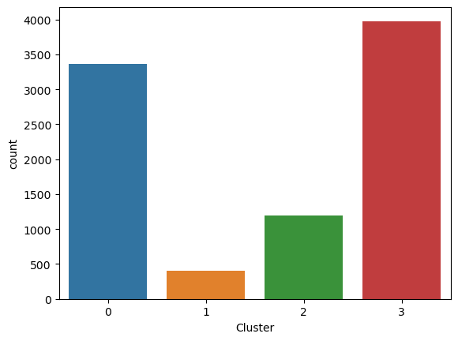
    


```python
# to display the distribution of various columns (features) in each cluster 
for c in cluster_df.drop(['Cluster'],axis=1):
    grid= sns.FacetGrid(cluster_df, col='Cluster')
    grid= grid.map(plt.hist, c)
plt.show()
```


    
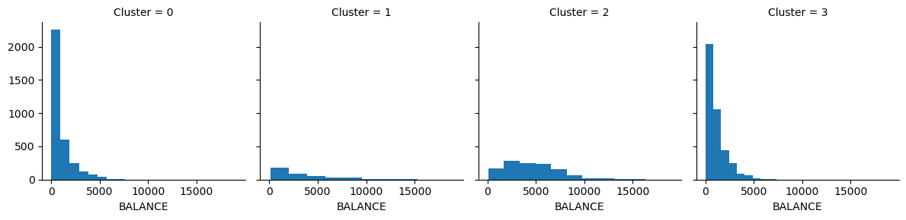
    


    
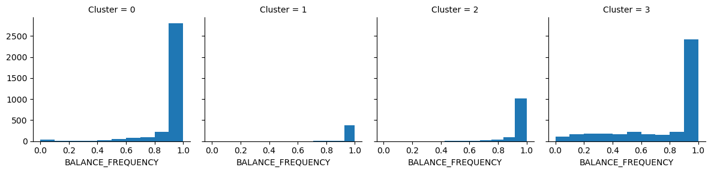
    


    
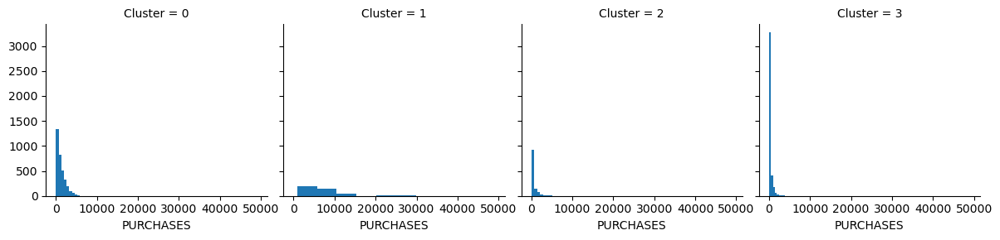
    


    
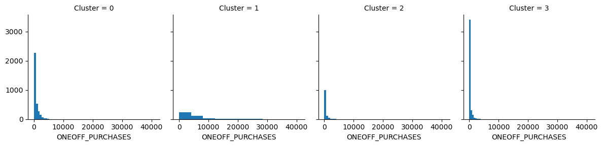
    


    
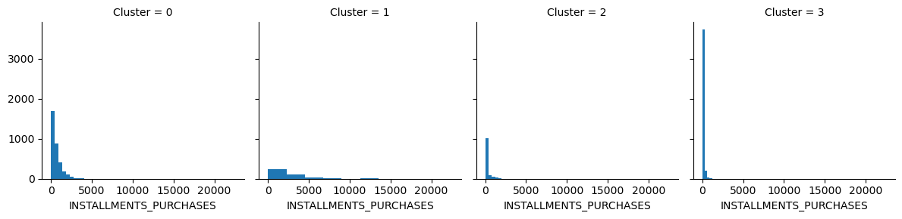
    


    
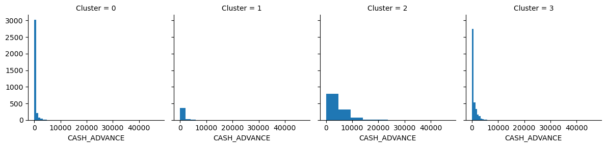
    


    
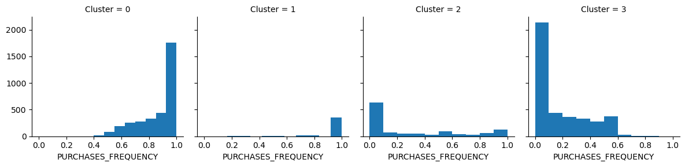
    


    
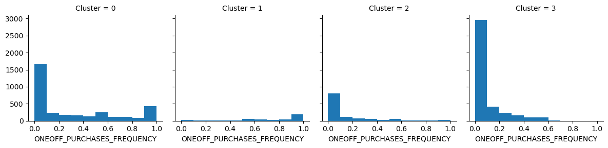
    


    
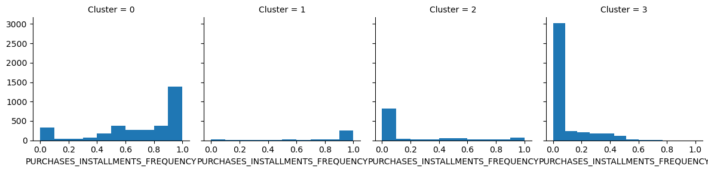
    


    
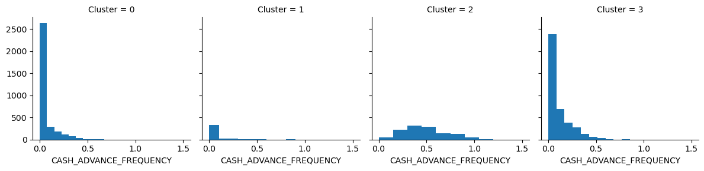
    


    
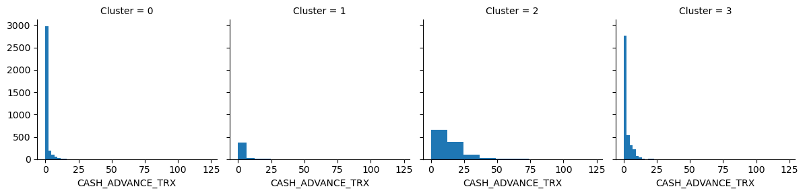
    


    
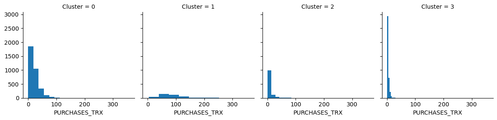
    


    
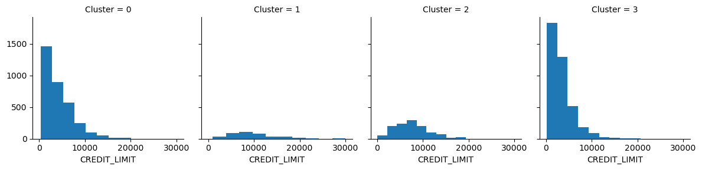
    


    
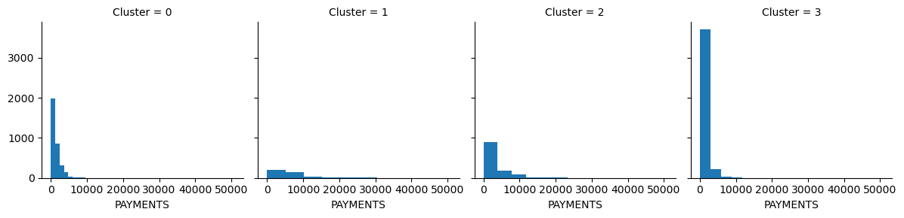
    


    
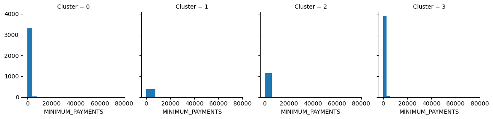
    


    
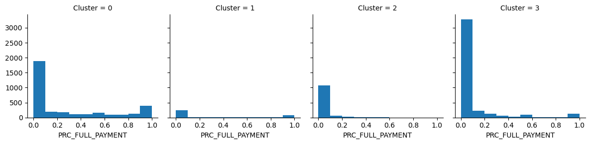
    


    
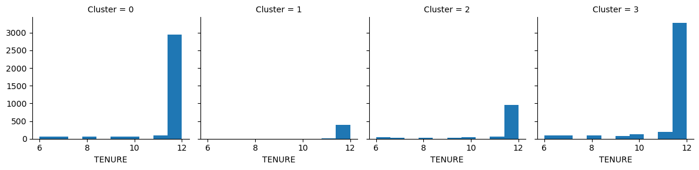
    


```python
#Saving Scikitlearn models
import joblib
joblib.dump(kmeans_model, "kmeans_model.pkl")
```


    ['kmeans_model.pkl']


```python
# saving the clustered dataset into a csv file
cluster_df.to_csv("Clustered_Customer_Data.csv")
```


```python
#Split Dataset into training and testing
X = cluster_df.drop(['Cluster'],axis=1)
y= cluster_df[['Cluster']]
X_train, X_test, y_train, y_test =train_test_split(X, y, test_size=0.3)
```


```python
X_train
```


<div>
<style scoped>
    .dataframe tbody tr th:only-of-type {
        vertical-align: middle;
    }

    .dataframe tbody tr th {
        vertical-align: top;
    }

    .dataframe thead th {
        text-align: right;
    }
</style>
<table border="1" class="dataframe">
  <thead>
    <tr style="text-align: right;">
      <th></th>
      <th>BALANCE</th>
      <th>BALANCE_FREQUENCY</th>
      <th>PURCHASES</th>
      <th>ONEOFF_PURCHASES</th>
      <th>INSTALLMENTS_PURCHASES</th>
      <th>CASH_ADVANCE</th>
      <th>PURCHASES_FREQUENCY</th>
      <th>ONEOFF_PURCHASES_FREQUENCY</th>
      <th>PURCHASES_INSTALLMENTS_FREQUENCY</th>
      <th>CASH_ADVANCE_FREQUENCY</th>
      <th>CASH_ADVANCE_TRX</th>
      <th>PURCHASES_TRX</th>
      <th>CREDIT_LIMIT</th>
      <th>PAYMENTS</th>
      <th>MINIMUM_PAYMENTS</th>
      <th>PRC_FULL_PAYMENT</th>
      <th>TENURE</th>
    </tr>
  </thead>
  <tbody>
    <tr>
      <th>6162</th>
      <td>161.576879</td>
      <td>0.909091</td>
      <td>194.00</td>
      <td>59.00</td>
      <td>135.00</td>
      <td>0.000000</td>
      <td>0.416667</td>
      <td>0.083333</td>
      <td>0.333333</td>
      <td>0.000000</td>
      <td>0</td>
      <td>6</td>
      <td>5000.0</td>
      <td>738.457844</td>
      <td>197.425096</td>
      <td>0.100000</td>
      <td>12</td>
    </tr>
    <tr>
      <th>8395</th>
      <td>4743.748932</td>
      <td>1.000000</td>
      <td>399.00</td>
      <td>0.00</td>
      <td>399.00</td>
      <td>1112.247446</td>
      <td>0.666667</td>
      <td>0.000000</td>
      <td>0.583333</td>
      <td>0.166667</td>
      <td>3</td>
      <td>8</td>
      <td>5000.0</td>
      <td>1259.057672</td>
      <td>1481.732235</td>
      <td>0.000000</td>
      <td>12</td>
    </tr>
    <tr>
      <th>7541</th>
      <td>1062.024069</td>
      <td>1.000000</td>
      <td>0.00</td>
      <td>0.00</td>
      <td>0.00</td>
      <td>402.337729</td>
      <td>0.000000</td>
      <td>0.000000</td>
      <td>0.000000</td>
      <td>0.200000</td>
      <td>3</td>
      <td>0</td>
      <td>1200.0</td>
      <td>583.533230</td>
      <td>267.478951</td>
      <td>0.000000</td>
      <td>10</td>
    </tr>
    <tr>
      <th>4182</th>
      <td>39.086623</td>
      <td>0.545455</td>
      <td>374.63</td>
      <td>91.63</td>
      <td>283.00</td>
      <td>0.000000</td>
      <td>0.500000</td>
      <td>0.083333</td>
      <td>0.500000</td>
      <td>0.000000</td>
      <td>0</td>
      <td>11</td>
      <td>1600.0</td>
      <td>767.182519</td>
      <td>168.259829</td>
      <td>1.000000</td>
      <td>12</td>
    </tr>
    <tr>
      <th>3006</th>
      <td>3473.463277</td>
      <td>1.000000</td>
      <td>1182.95</td>
      <td>718.75</td>
      <td>464.20</td>
      <td>0.000000</td>
      <td>1.000000</td>
      <td>0.583333</td>
      <td>1.000000</td>
      <td>0.000000</td>
      <td>0</td>
      <td>36</td>
      <td>6000.0</td>
      <td>955.667752</td>
      <td>1243.191013</td>
      <td>0.000000</td>
      <td>12</td>
    </tr>
    <tr>
      <th>...</th>
      <td>...</td>
      <td>...</td>
      <td>...</td>
      <td>...</td>
      <td>...</td>
      <td>...</td>
      <td>...</td>
      <td>...</td>
      <td>...</td>
      <td>...</td>
      <td>...</td>
      <td>...</td>
      <td>...</td>
      <td>...</td>
      <td>...</td>
      <td>...</td>
      <td>...</td>
    </tr>
    <tr>
      <th>5782</th>
      <td>1.864427</td>
      <td>0.090909</td>
      <td>0.00</td>
      <td>0.00</td>
      <td>0.00</td>
      <td>93.468447</td>
      <td>0.000000</td>
      <td>0.000000</td>
      <td>0.000000</td>
      <td>0.083333</td>
      <td>1</td>
      <td>0</td>
      <td>1800.0</td>
      <td>0.000000</td>
      <td>864.206542</td>
      <td>0.000000</td>
      <td>12</td>
    </tr>
    <tr>
      <th>8135</th>
      <td>930.656420</td>
      <td>1.000000</td>
      <td>300.05</td>
      <td>0.00</td>
      <td>300.05</td>
      <td>0.000000</td>
      <td>0.750000</td>
      <td>0.000000</td>
      <td>0.750000</td>
      <td>0.000000</td>
      <td>0</td>
      <td>9</td>
      <td>1200.0</td>
      <td>513.064156</td>
      <td>330.422815</td>
      <td>0.000000</td>
      <td>12</td>
    </tr>
    <tr>
      <th>7249</th>
      <td>365.674097</td>
      <td>1.000000</td>
      <td>1169.73</td>
      <td>1169.73</td>
      <td>0.00</td>
      <td>0.000000</td>
      <td>0.333333</td>
      <td>0.333333</td>
      <td>0.000000</td>
      <td>0.000000</td>
      <td>0</td>
      <td>9</td>
      <td>1500.0</td>
      <td>877.026023</td>
      <td>527.451484</td>
      <td>0.000000</td>
      <td>12</td>
    </tr>
    <tr>
      <th>471</th>
      <td>3872.605467</td>
      <td>1.000000</td>
      <td>0.00</td>
      <td>0.00</td>
      <td>0.00</td>
      <td>1483.933054</td>
      <td>0.000000</td>
      <td>0.000000</td>
      <td>0.000000</td>
      <td>0.416667</td>
      <td>8</td>
      <td>0</td>
      <td>4000.0</td>
      <td>1067.405461</td>
      <td>911.085430</td>
      <td>0.000000</td>
      <td>12</td>
    </tr>
    <tr>
      <th>2951</th>
      <td>180.230777</td>
      <td>0.818182</td>
      <td>1653.91</td>
      <td>997.10</td>
      <td>656.81</td>
      <td>0.000000</td>
      <td>0.750000</td>
      <td>0.666667</td>
      <td>0.583333</td>
      <td>0.000000</td>
      <td>0</td>
      <td>35</td>
      <td>11500.0</td>
      <td>1785.782313</td>
      <td>159.467950</td>
      <td>0.555556</td>
      <td>12</td>
    </tr>
  </tbody>
</table>
<p>6265 rows × 17 columns</p>
</div>


```python
X_test
```


<div>
<style scoped>
    .dataframe tbody tr th:only-of-type {
        vertical-align: middle;
    }

    .dataframe tbody tr th {
        vertical-align: top;
    }

    .dataframe thead th {
        text-align: right;
    }
</style>
<table border="1" class="dataframe">
  <thead>
    <tr style="text-align: right;">
      <th></th>
      <th>BALANCE</th>
      <th>BALANCE_FREQUENCY</th>
      <th>PURCHASES</th>
      <th>ONEOFF_PURCHASES</th>
      <th>INSTALLMENTS_PURCHASES</th>
      <th>CASH_ADVANCE</th>
      <th>PURCHASES_FREQUENCY</th>
      <th>ONEOFF_PURCHASES_FREQUENCY</th>
      <th>PURCHASES_INSTALLMENTS_FREQUENCY</th>
      <th>CASH_ADVANCE_FREQUENCY</th>
      <th>CASH_ADVANCE_TRX</th>
      <th>PURCHASES_TRX</th>
      <th>CREDIT_LIMIT</th>
      <th>PAYMENTS</th>
      <th>MINIMUM_PAYMENTS</th>
      <th>PRC_FULL_PAYMENT</th>
      <th>TENURE</th>
    </tr>
  </thead>
  <tbody>
    <tr>
      <th>1977</th>
      <td>49.869884</td>
      <td>1.0</td>
      <td>363.52</td>
      <td>124.51</td>
      <td>239.01</td>
      <td>0.000000</td>
      <td>0.833333</td>
      <td>0.166667</td>
      <td>0.666667</td>
      <td>0.000000</td>
      <td>0</td>
      <td>11</td>
      <td>9100.0</td>
      <td>383.100848</td>
      <td>175.869439</td>
      <td>0.181818</td>
      <td>12</td>
    </tr>
    <tr>
      <th>7811</th>
      <td>2896.148480</td>
      <td>1.0</td>
      <td>321.81</td>
      <td>118.16</td>
      <td>203.65</td>
      <td>1925.397633</td>
      <td>0.500000</td>
      <td>0.166667</td>
      <td>0.250000</td>
      <td>0.333333</td>
      <td>4</td>
      <td>9</td>
      <td>3500.0</td>
      <td>599.846140</td>
      <td>1440.449304</td>
      <td>0.000000</td>
      <td>12</td>
    </tr>
    <tr>
      <th>3753</th>
      <td>3315.689234</td>
      <td>1.0</td>
      <td>1434.88</td>
      <td>740.00</td>
      <td>694.88</td>
      <td>5802.393776</td>
      <td>1.000000</td>
      <td>0.083333</td>
      <td>1.000000</td>
      <td>0.583333</td>
      <td>25</td>
      <td>22</td>
      <td>6000.0</td>
      <td>4608.192303</td>
      <td>2742.232319</td>
      <td>0.000000</td>
      <td>12</td>
    </tr>
    <tr>
      <th>8874</th>
      <td>686.623746</td>
      <td>1.0</td>
      <td>422.21</td>
      <td>149.00</td>
      <td>273.21</td>
      <td>729.332469</td>
      <td>1.000000</td>
      <td>0.333333</td>
      <td>0.833333</td>
      <td>0.166667</td>
      <td>2</td>
      <td>11</td>
      <td>1000.0</td>
      <td>416.560172</td>
      <td>82.401461</td>
      <td>0.000000</td>
      <td>6</td>
    </tr>
    <tr>
      <th>4729</th>
      <td>1512.218864</td>
      <td>1.0</td>
      <td>1002.93</td>
      <td>825.89</td>
      <td>177.04</td>
      <td>0.000000</td>
      <td>1.000000</td>
      <td>0.833333</td>
      <td>0.333333</td>
      <td>0.000000</td>
      <td>0</td>
      <td>23</td>
      <td>4000.0</td>
      <td>328.446221</td>
      <td>344.205824</td>
      <td>0.000000</td>
      <td>12</td>
    </tr>
    <tr>
      <th>...</th>
      <td>...</td>
      <td>...</td>
      <td>...</td>
      <td>...</td>
      <td>...</td>
      <td>...</td>
      <td>...</td>
      <td>...</td>
      <td>...</td>
      <td>...</td>
      <td>...</td>
      <td>...</td>
      <td>...</td>
      <td>...</td>
      <td>...</td>
      <td>...</td>
      <td>...</td>
    </tr>
    <tr>
      <th>564</th>
      <td>1095.379426</td>
      <td>1.0</td>
      <td>0.00</td>
      <td>0.00</td>
      <td>0.00</td>
      <td>282.895246</td>
      <td>0.000000</td>
      <td>0.000000</td>
      <td>0.000000</td>
      <td>0.250000</td>
      <td>3</td>
      <td>0</td>
      <td>1200.0</td>
      <td>432.048813</td>
      <td>256.494357</td>
      <td>0.000000</td>
      <td>12</td>
    </tr>
    <tr>
      <th>4547</th>
      <td>2439.976275</td>
      <td>1.0</td>
      <td>499.59</td>
      <td>0.00</td>
      <td>499.59</td>
      <td>0.000000</td>
      <td>0.916667</td>
      <td>0.000000</td>
      <td>0.916667</td>
      <td>0.000000</td>
      <td>0</td>
      <td>11</td>
      <td>2700.0</td>
      <td>555.286351</td>
      <td>617.276328</td>
      <td>0.000000</td>
      <td>12</td>
    </tr>
    <tr>
      <th>342</th>
      <td>1254.669100</td>
      <td>1.0</td>
      <td>361.73</td>
      <td>361.73</td>
      <td>0.00</td>
      <td>198.686744</td>
      <td>0.166667</td>
      <td>0.166667</td>
      <td>0.000000</td>
      <td>0.083333</td>
      <td>1</td>
      <td>2</td>
      <td>1500.0</td>
      <td>535.606816</td>
      <td>432.688080</td>
      <td>0.000000</td>
      <td>12</td>
    </tr>
    <tr>
      <th>7994</th>
      <td>110.983174</td>
      <td>1.0</td>
      <td>458.47</td>
      <td>458.47</td>
      <td>0.00</td>
      <td>0.000000</td>
      <td>0.250000</td>
      <td>0.250000</td>
      <td>0.000000</td>
      <td>0.000000</td>
      <td>0</td>
      <td>3</td>
      <td>2000.0</td>
      <td>414.618729</td>
      <td>176.175087</td>
      <td>0.000000</td>
      <td>12</td>
    </tr>
    <tr>
      <th>795</th>
      <td>644.530629</td>
      <td>1.0</td>
      <td>268.68</td>
      <td>0.00</td>
      <td>268.68</td>
      <td>0.000000</td>
      <td>1.000000</td>
      <td>0.000000</td>
      <td>1.000000</td>
      <td>0.000000</td>
      <td>0</td>
      <td>12</td>
      <td>1200.0</td>
      <td>1557.689460</td>
      <td>438.318992</td>
      <td>0.166667</td>
      <td>12</td>
    </tr>
  </tbody>
</table>
<p>2685 rows × 17 columns</p>
</div>


```python
#Decision_Tree
model= DecisionTreeClassifier(criterion="entropy")
model.fit(X_train, y_train)
y_pred = model.predict(X_test)
```


```python
#Confusion_Matrix - looking at the performance of the model
print(metrics.confusion_matrix(y_test, y_pred))
print(classification_report(y_test, y_pred))
```

    [[ 935   11   10   32]
     [  16  109    4    1]
     [   9    4  302   17]
     [  27    1   24 1183]]
                  precision    recall  f1-score   support
    
               0       0.95      0.95      0.95       988
               1       0.87      0.84      0.85       130
               2       0.89      0.91      0.90       332
               3       0.96      0.96      0.96      1235
    
        accuracy                           0.94      2685
       macro avg       0.92      0.91      0.91      2685
    weighted avg       0.94      0.94      0.94      2685
    
    


```python
# saving the model
import pickle
filename = 'final_model.sav'
pickle.dump(model, open(filename, 'wb'))
 
# some time later...
 
# load the model from disk
loaded_model = pickle.load(open(filename, 'rb'))
result = loaded_model.score(X_test, y_test)
result=result*100
print(result,'% Accuracy')
```

    94.1899441340782 % Accuracy
    


```python

```
